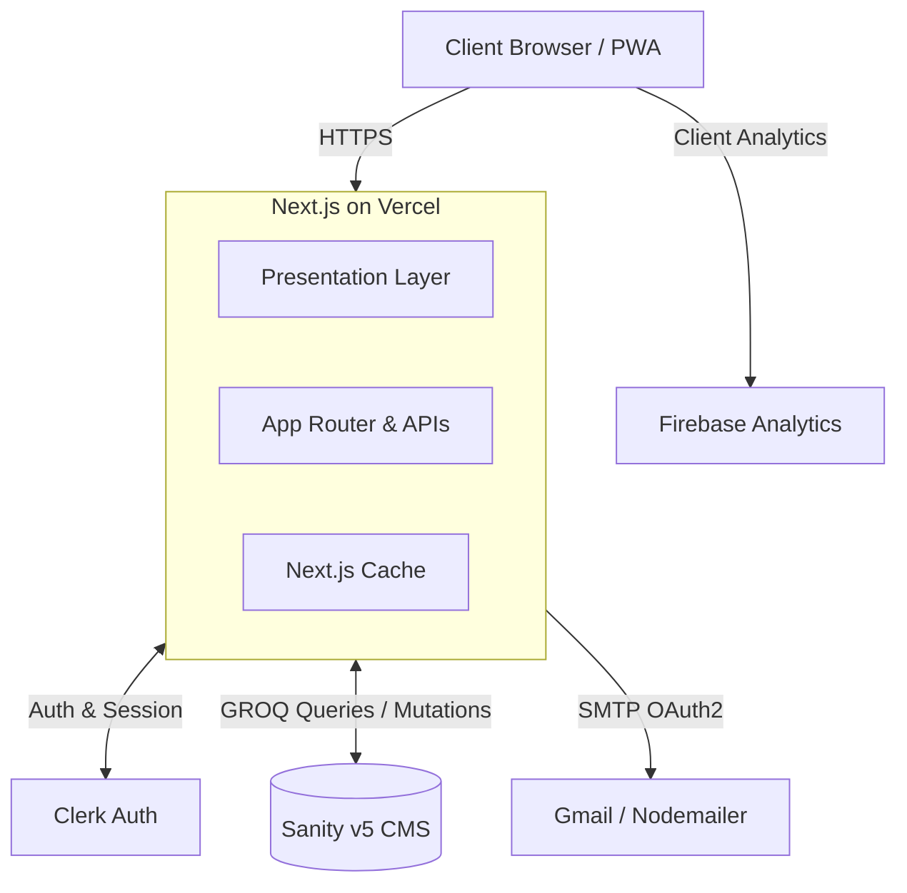
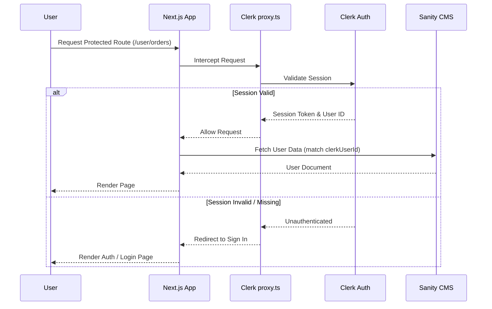
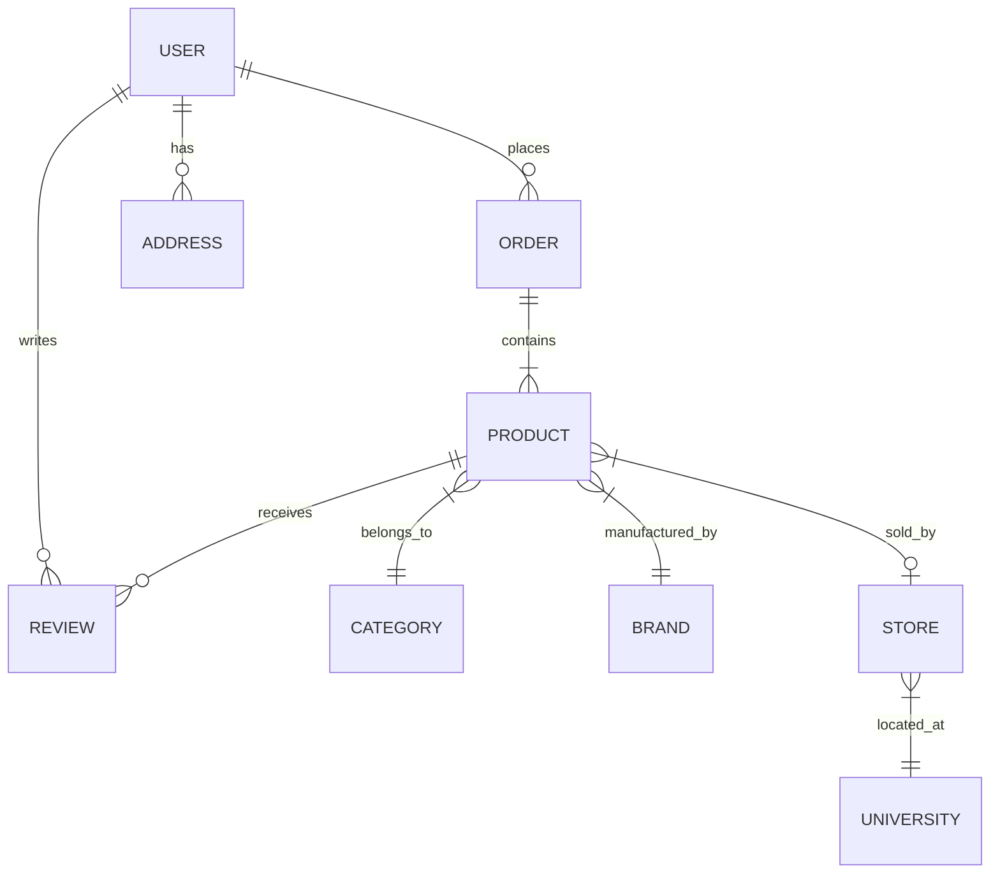
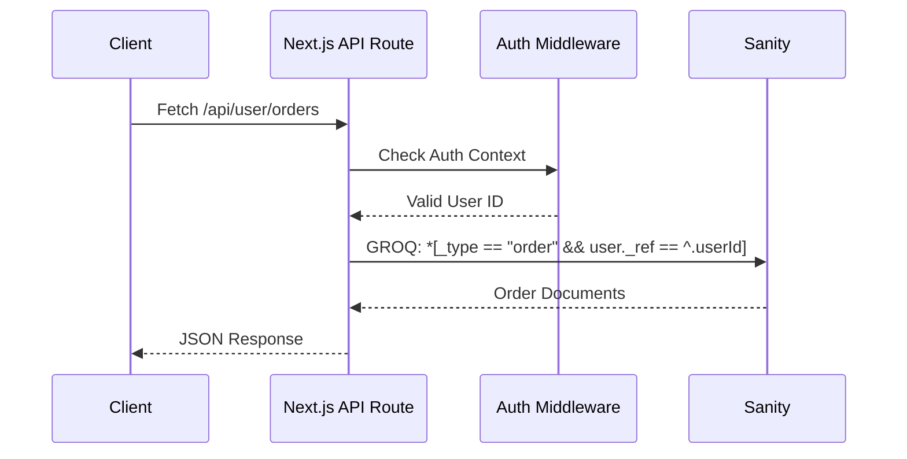
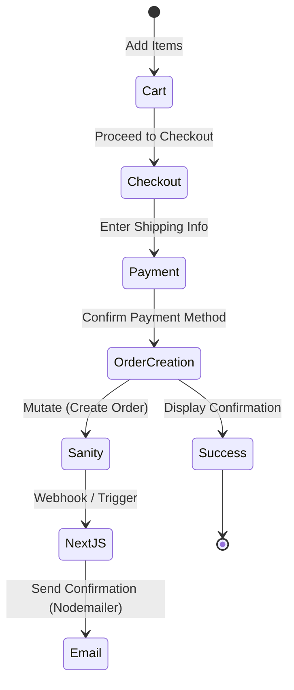

# UShop Architecture Document

This document provides a comprehensive overview of the architecture, tech stack, data models, and system flows for the UShop application.

## Tech Stack

- **Framework**: Next.js 16.2.11 (App Router, React 19.2.4)
- **Language**: TypeScript 5
- **Styling**: Tailwind CSS v4 with `@tailwindcss/postcss`, `tw-animate-css`
- **UI Components**: shadcn/ui (base-rhea style), `@base-ui/react` v1.6.0, `@radix-ui/react-dialog`, `@radix-ui/react-tabs`
- **CMS & Database**: Sanity v5 with `next-sanity` v13.1.1, GROQ queries
- **Authentication**: Clerk (`@clerk/nextjs` v6.9.6)
- **State Management**: Zustand v5.0.8 (persistent cart/wishlist store)
- **Analytics**: Firebase v12.16.0, Vercel Analytics, Vercel Speed Insights
- **Email**: Nodemailer v9 with Google OAuth2
- **Charts**: Recharts v3.3.0
- **Animations**: Framer Motion / Motion v12
- **Icons**: Lucide React, React Icons, `@sanity/icons`
- **Carousel**: `embla-carousel-react` v8.6.0
- **Date**: `date-fns` v4, `dayjs` v1.11
- **Location**: `country-state-city` v3.2.1
- **Build**: pnpm, Turbopack (dev), Vercel (production)

---

## Architecture Overview

UShop follows a **layered architecture** to separate concerns and improve maintainability:

1. **Presentation Layer**: React components (Server + Client), Tailwind CSS
2. **Application Layer**: Next.js App Router, API Routes, Server Actions
3. **State Layer**: Zustand (client), React Context (`UserDataContext`), URL params (filters)
4. **Data Layer**: Sanity v5 (headless CMS), GROQ queries with Next.js caching
5. **Auth Layer**: Clerk middleware (`proxy.ts`), `ClerkProvider`
6. **Infrastructure**: Vercel deployment, Firebase Analytics, Gmail SMTP

### High-Level System Architecture



---

## Directory Structure

```text
app/
├── (auth)/              # Auth routes (sign-in, sign-up, forgot-password, sso-callback)
├── (client)/            # Main app routes
│   ├── (user)/          # Protected user routes (cart, checkout, wishlist, user/*)
│   ├── admin/           # Admin redirect
│   ├── brands/          # Brand pages
│   ├── category/        # Category pages  
│   ├── deals/           # Deal pages
│   ├── product/         # Product pages
│   ├── shop/            # Shop page
│   ├── stores/          # Store pages
│   └── universities/    # University pages
├── api/                 # API routes
│   ├── admin/           # Admin APIs (30+ endpoints)
│   ├── analytics/       # Analytics APIs
│   ├── checkout/        # Payment APIs
│   ├── orders/          # Order APIs
│   ├── user/            # User APIs
│   └── ...              # Other APIs
├── offline/             # PWA offline fallback
└── studio/              # Embedded Sanity Studio
```

---

## Authentication Architecture

UShop uses Clerk for authentication and session management.

- `proxy.ts` (Clerk middleware) protects `/user/*` and `/admin/*` routes.
- `ClerkProvider` wraps the app in `(client)` and `(auth)` layouts.
- Clerk user ID is mapped to Sanity user documents via the `clerkUserId` field.
- Admin authorization: Checks `NEXT_PUBLIC_ADMIN_EMAIL` env var OR the `isAdmin` flag on the Sanity user document.
- Auth modal (`useAuthModal` Zustand store) for inline sign-in prompts.

### Authentication Flow



---

## State Management Architecture

State is managed across different layers based on persistence and scope requirements:

1. **Zustand Cart Store** (`store.ts`, persisted to localStorage as `cart-store`):
   - Cart items, add/remove/delete, totals calculation
   - Wishlist/favorites management
   - Order placement progress state
2. **UserDataContext** (React Context):
   - Fetches from `/api/user/combined-data`
   - Caches `ordersCount`, `unreadNotifications`, `walletBalance` (30s TTL)
3. **URL Search Params**: Filter state for `/shop`, `/category/[slug]`, `/brands/[slug]`
4. **Server-side Cache** (`lib/cache.ts`):
   - `CACHE_TAGS` for products, categories, brands, users, orders, reviews
   - Volatility-based revalidation: `STATIC` (3600s), `HOMEPAGE` (300s), `PRODUCT_LIST` (600s), etc.
   - Invalidation functions for targeted cache busting

---

## Data Architecture (Sanity Schema)

The database schema consists of 18 document types. Key entities include:

1. `user` - Full profile synced with Clerk (addresses, preferences, wallet, rewardPoints, studentStatus)
2. `product` - Multi-tab product (info, specs, pricing/inventory, images, reviews)
3. `order` - Orders with GHS currency (orderNumber, items, shipping, payment, status tracking)
4. `category` - Hierarchical taxonomy (department → main → sub → item_type) with dynamic attributes
5. `productClassification` - Top-level types (Physical Tech, Digital Product, Tech Service)
6. `brand` - Tech brand catalog
7. `store` - Campus seller storefronts
8. `university` - Campus entities for localized marketplaces
9. `location` - Geographical meetup locations
10. `address` - Shipping/billing addresses (home, office, hostel, campus_hall)
11. `attribute` - Dynamic product specs (RAM, Storage, CPU, Screen Size)
12. `review` - Product reviews with moderation workflow
13. `subscription` - Newsletter subscribers
14. `userAccessRequest` - Business/Premium account request workflow
15. `sentNotification` - Admin notification broadcast ledger
16. `banner` - Homepage promotional banners
17. `contact` - Contact form submissions
18. `author` - Content author schema

### Entity Relationship (ER) Diagram



---

## API Architecture & Request Flow

UShop exposes 70+ API routes organized by domain:
- `/api/admin/*` (30+ endpoints) - Admin operations
- `/api/user/*` (15+ endpoints) - User operations
- `/api/orders/*` (8 endpoints) - Order management
- `/api/checkout/*` (3 endpoints) - Payment processing
- `/api/analytics/*` (2 endpoints) - Analytics tracking
- `/api/newsletter/*` (2 endpoints) - Newsletter management
- `/api/search`, `/api/contact`, `/api/webhook` - Misc

All admin APIs verify admin permissions. All user APIs use Clerk auth.

### API Request Flow



---

## Order / Checkout Flow



---

## PWA Architecture

- **Service Worker** (`public/sw.js`) with 3 caches: `ushop-static-v1`, `ushop-dynamic-v1`, `ushop-images-v1`
- **Cache strategies**: 
  - Cache-first (static assets)
  - Cache-first with FIFO trimming (images, 100 max)
  - Network-first (HTML with `/offline` fallback)
  - Stale-while-revalidate (JSON)
- **Skips**: `/api/*`, `/studio`, Clerk domains, Sanity endpoints, HMR
- `manifest.ts` generates PWA manifest
- `ServiceWorkerRegister.tsx` registers SW in production

---

## Caching Strategy

Next.js `unstable_cache` is utilized with tag-based revalidation:

- Banners: 300s
- Featured categories: 900s
- All products: 600s
- Deal products: 300s
- Brands: 3600s
- Categories: 900s
- Product detail: 1800s
- Stores: 30s (near-realtime)
- User data: **No cache**

---

## Email Architecture

- **Provider**: Nodemailer with Google OAuth2 (Gmail SMTP)
- **Use Cases**:
  - Order confirmation emails with product images
  - Newsletter welcome emails
  - Contact form notification emails
- **Templates**: HTML email templates with Sanity image URL conversion to ensure compatibility across email clients.

---

## Deployment Architecture

- **Platform**: Vercel
- **Branch**: `develop`
- **Build Command**: `pnpm run build` (Next.js build)
- **Environment**: 2 cores, 8 GB RAM
- **Git**: SSH (`git@github.com:QweciKuranchie/UShop.git`)
